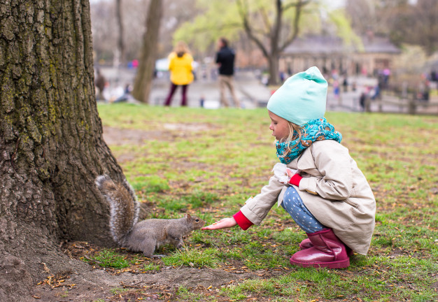

# Squirrel Tracker for the eccentric Joffrey Hosencratz




## High-level description

We have created a web application developed with the Django framework in order to ke
ep track of all the known squirrels in Central Park. In this web app you are able to
 add, update, and view squirrel data.

## Contributors

### Project Group 22, Section 2

UNIs: [cw2684, ssb2203]

Chloe Walmsley and Shruti Bhat

## Dataset

The data for the squirrel sightings has been imported from the [2018 Central Park Sq
uirrel Census] (https://data.cityofnewyork.us/Environment/2018-Central-Park-Squirrel
-Census-Squirrel-Data/vfnx-vebw). The dataset contains 3’023 rows and 31 columns, ea
ch row representing a unique squirrel sighting. Each sighting includes detailed info
rmation including the location coordinates of the sighting, the physical attributes 
of the squirrel and the type of activity it was seen doing.

## Installation and dependencies

If you wish to run our code we recommend you:

1. Clone the repository with the HTTPS link:

```bash
git clone https://github.com/shrubhat1997/SquirrelTracker.git
```

2. Install our requirements.txt to ensure the code runs smoothly on your machine

```bash
$ pip install -r requirements.txt
```

## Main Functions

The web app includes the following key functions.

### View squirrel sightings list

The Central Park squirrel sightings of 2018 can be viewed as a list here and you can
 click to see more details about the sightings as well.

```bash
Located at : sightings/
```

### View squirrel sightings on a map

Squirrel sittings can be viewed on the map of Central Park.

```bash
Located at : map/
```

### View squirrel sightings statistics

Squirrel statistics are shared about key features of the dataset.

```bash
Located at : sightings/stats/
```

### Update squirrel sightings

Squirrel sightings can be adapted to correct information.

```bash
Located at : sightings/<squirrel-id>
                                                                  
### Create new squirrel sightings

New squirrel sittings can be added to the application at any time.

```bash
Located at : sightings/add/
```

## Deployment

We have deployed are application which is available at this link:
TBD

